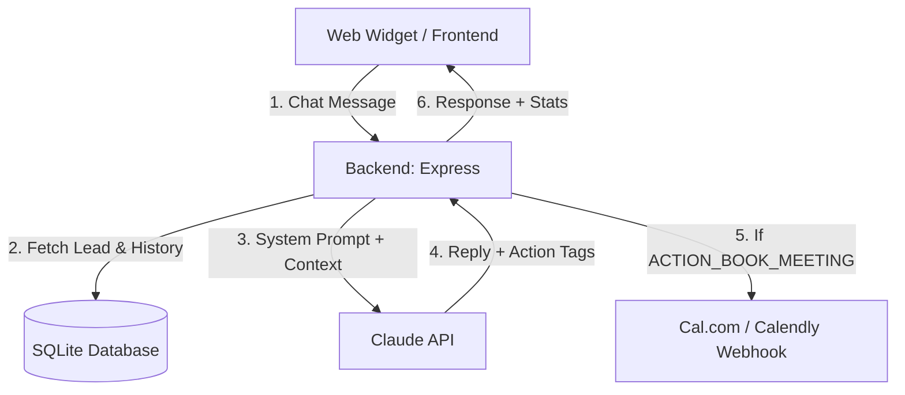

# SetFlow.ai — Your AI Appointment Setter That Never Sleeps

> **Stop chasing leads. Let AI book your meetings on autopilot.**

SetFlow.ai is a fully functional, open-source AI-powered appointment setter that captures leads, handles objections, answers pricing questions, and books discovery calls — all without human intervention. Built with Node.js, Express, SQLite, and the Anthropic Claude API.

**This is not a demo. This is production-ready.**

[](https://render.com/deploy?repo=https://github.com/voidreformer/setflow-ai)

---

## What It Does

- **AI Chat Agent** — A smart conversational assistant that qualifies leads, answers questions about your services, handles objections, and guides visitors to book a call
- **Lead Capture & Tracking** — Automatically captures visitor info, tracks status (unqualified → qualified → booked), and stores full chat history
- **Auto-Booking Detection** — AI recognizes when a user agrees to book and triggers the booking flow automatically
- **Webhook Integration** — Connects with Cal.com / Calendly to confirm bookings and match them to leads
- **Dashboard** — Real-time stats, recent bookings, lead management with search & filters
- **Configurable AI Persona** — Edit the system prompt, company name, and calendar link from the UI

---

## Screenshots

```
┌─────────────────────────────────────────────────────┐
│  🟢 SetFlow.ai                                      │
│  ├── 📊 Dashboard (Live Chat + Stats + Bookings)     │
│  ├── 👥 Leads (Table + Filters + Chat History)       │
│  ├── 📅 Calendar / Webhooks (Cal.com Integration)    │
│  └── 🤖 AI Agent Config (System Prompt Editor)       │
└─────────────────────────────────────────────────────┘
```

---

## Quick Start

```bash
# 1. Clone the repo
git clone https://github.com/voidreformer/setflow-ai.git
cd setflow-ai

# 2. Install dependencies
npm install

# 3. Set up your environment
cp .env.example .env
# Edit .env with your Anthropic API key

# 4. Start the server
npm start

# 5. Open in browser
# http://localhost:3000
```

### Environment Variables

| Variable | Description | Default |
|----------|-------------|---------|
| `ANTHROPIC_API_KEY` | Your Anthropic API key | — |
| `ANTHROPIC_BASE_URL` | Custom API base URL (optional) | Anthropic default |
| `CLAUDE_MODEL` | Claude model to use | `claude-sonnet-4-20250514` |
| `PORT` | Server port | `3000` |

---

## Tech Stack

- **Backend:** Node.js + Express
- **Database:** SQLite (via sql.js — zero config, no external DB needed)
- **AI:** Anthropic Claude API
- **Frontend:** Vanilla HTML/CSS/JS — no framework bloat
- **UI:** Glassmorphism design, HSL variables, responsive layout, smooth animations

---

## Architecture



---

## API Endpoints

| Method | Endpoint | Description |
|--------|----------|-------------|
| `POST` | `/api/chat` | Send a message, get AI response |
| `POST` | `/api/leads` | Create a new lead |
| `GET` | `/api/leads` | List all leads (optional `?status=` filter) |
| `GET` | `/api/leads/:id` | Get a specific lead |
| `GET` | `/api/leads/:id/history` | Get chat history for a lead |
| `DELETE` | `/api/leads/:id` | Delete a lead |
| `GET` | `/api/stats` | Dashboard statistics |
| `GET` | `/api/bookings` | Recent confirmed bookings |
| `GET` | `/api/config` | Get AI agent configuration |
| `PUT` | `/api/config` | Update system prompt & calendar link |
| `POST` | `/api/webhooks/calendar` | Receive Cal.com booking webhooks |
| `GET` | `/api/webhooks/events` | List recent webhook events |

---

## How the AI Books Meetings

1. Visitor enters name & email → lead is created as `unqualified`
2. AI chats naturally — answers questions, handles objections
3. When visitor shows interest (mentions "schedule", "book", "meeting"), lead becomes `qualified`
4. When AI determines user is ready, it includes `[ACTION_BOOK_MEETING]` in its response → lead becomes `booked`
5. Cal.com webhook confirms the actual booking and matches it back to the lead

---

## Free & Open Source

This is a **free sample** — use it, fork it, deploy it, make money with it. If demand is strong, premium features and hosted plans are coming.

---

## Special Thanks

**Massive shoutout to [Vaibhav Sisinty](https://github.com/vaibhavsisinty)** for the inspiration, guidance, and pushing the boundaries of what AI-powered tools can do. This project wouldn't exist without his vision.

---

## License

MIT — do whatever you want with it.

---

**Built with caffeine, Claude, and the belief that no lead should go unfollowed.**
